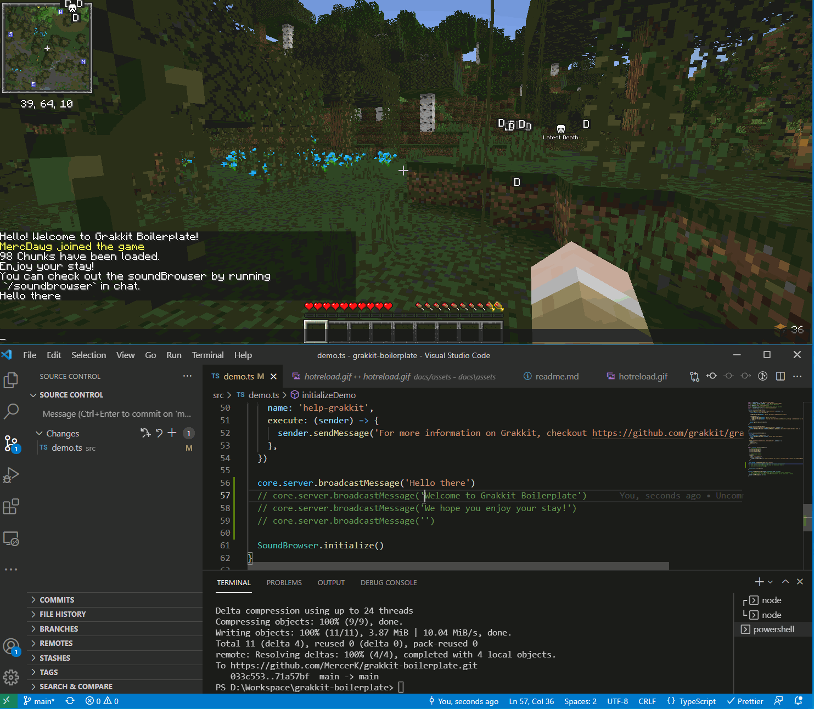

# Grakkit Boilerplate

> Useful boilerplate for creating stuff with [Grakkit](https://github.com/grakkit/grakkit)

Grakkit is a Minecraft Server Plugin utilizing the GraalVM JavaScript Engine. This repository is a boilerplate
implementation to quickly spawn up a workspace to get started using Babel, Webpack, and TypeScript.

This boilerplate features a "Hot Reload" method, which speeds up development significantly. Whenever you make changes to
your code during Runtime and hit save, it'll rebuild the solution then reload it on the server. This takes less than a
second.

# Getting Started

1. Click the "Use this template" in the top right.
2. Once you have cloned the repo and have it locally, you'll need to do the following:

- Download your preferred Minecraft Server Plugin implementation
  - Grakkit only supports [Paper](https://papermc.io/downloads) or Minestom.
- Place the server plugin jar file in the `./server` folder and rename it to `server.jar`.
- Download the [Grakkit jar](https://github.com/grakkit/grakkit/releases) and place it in the `./server/plugins` folder.
- Run `npm install` or `yarn`.
- Open a terminal and run `npm run start:js` or `yarn start:js`. This will start the webpack.
- Open another terminal and run `npm run start:server` or `yarn start:server`
  - When running it for the first time, you'll need to accept the `EULA` in `./server/eula.txt`.
  - After updating the `EULA`, you may need to restart the server.

3. Once everything is up and running, you can now start developing in `./src/index.ts`.

# What can you do with this?

- Through Grakkit, you have access to both Java and Paper classes, objects, and types.
- You can access the API of other server plugins, such as LibsDisguises, PlaceholderAPI, and so many more.
- You can import existing JavaScript libraries and use them within your plugin, such as Lodash, Redux, Yaml, Immer, and
  so many more.
  - Note: NodeJS does not work within GraalVM, so you cannot use libraries expecting NodeJS API.
  - Note: Fetch/Websockets/Multithreading can be a challenge.

# How It Works

## Development Mode `npm run start:js`/`yarn start:js`

1. This spawns a webserver within the Minecraft server.
2. When in development mode, it enables a new API route called `/reload`.
3. The solution is built using webpack (which is _fast_) and it will put the compiled files in `server/plugins/grakkit`.
4. Using a custom start up script in `scripts/start/index.ts`, it will build the solution, enable development mode, and
   ping the `/reload` endpoint.
   - Once the endpoint is hit, well, the server reloads grakkit.

## Production Mode `npm run build`/`yarn build`

1. Using webpack, it'll build the files to `/dist`. Any code relying on `development` will be disabled.
2. This can be a useful step for deployments.

# Startup

1. Run `npm run start:js` or `yarn start:js`
2. Run `npm run start:server` or `yarn start:server`

OR

1. Run `npm run start` or `yarn start`

# Info

## Deps Folder

When developing plugins, you may need to hook into additional dependencies. You can add those jars to the `./deps`
folder. If you need further customization, you can update `scripts/start/index.ts`.
